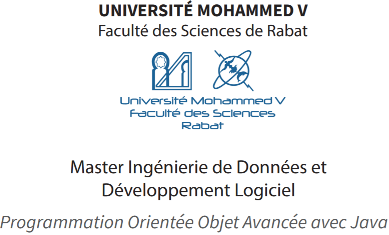
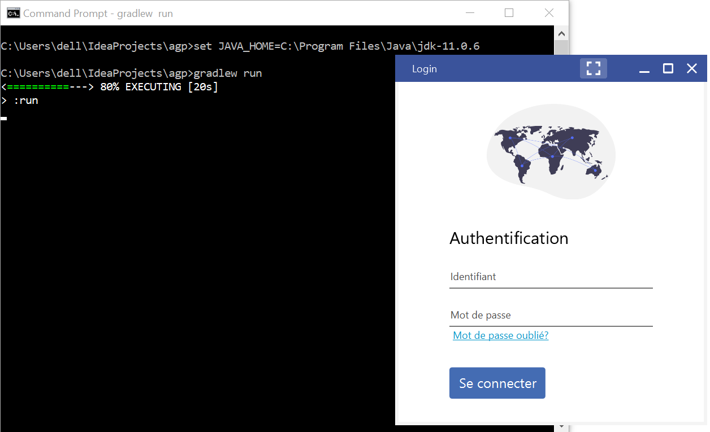

# Configuration du système, paramétrage et exécution de l'application
Vous pouvez essayer l'application par vous-même!

pour ce faire,

1.  Vous devrez d'abord **[cloner]** ou **[télécharger] et décompresser** le dépositaire de l'application.

Une fois que vous l'avez cloné ou téléchargé et décompressé,

2.  Ensuite, vérifier que vous disposiez de la version nécessaire du JDK (Java Development Kit) requise pour compiler les fichiers d'application. **La version requise est JDK 11**

2. **Ouvrez une invite de commande (uniquement sous Windows)** 
    1. <kbd></kbd>+<kbd>R</kbd>
    1. Entrez `cmd`
    1. Appuyez sur <kbd>Enter</kbd>

3. **Accédez à la racine du projet**
    1. Notez le chemin du répertoire du projet.
    2. Entrez `cd ` (qui signifie **c**hange **d**irectory) suivi du chemin du projet.
    3. Vous vous retrouverez avec quelque chose qui ressemble à ceci
        1. `cd C:\Users\YourUserName\IdeaProjects\agp` ou 
        2. `cd C:\Users\YourUserName\Downloads\agp-master\`
    4. Appuyez sur <kbd>Enter</kbd>
    
4. **Pour que vous puissiez exécuter l'application, une variable d'environnement `JAVA_HOME` doit pointer sur le répertoire d'installation JDK `jdk-11.0.X/`**
    1. Notez le chemin du répertoire d'installation JDK 11.
    2. Entrez `set JAVA_HOME=` (pour définir la variable d'environnement `JAVA_HOME`) suivi du chemin du répertoire d'installation JDK 11.
    3. Vous vous retrouverez avec quelque chose qui ressemble à ceci
        `set JAVA_HOME=C:\Program Files\Java\jdk-11.0.6` 
    4. Appuyez sur <kbd>Enter</kbd>

5. **Entrez `gradlew run` et appuyez sur <kbd>Enter</kbd> (sur linux et mac, tapez: `./gradlew run`).**
    (Cette application utilise le **gradle w**rapper pour charger et compiler les resources.)

5. **Et voilà!!**

[cloner]: https://help.github.com/articles/cloning-a-repository/
[télécharger]: https://github.com/h3t1/agp/archive/master.zip
[Gradle]: https://stackoverflow.com/a/24828666/5432315
